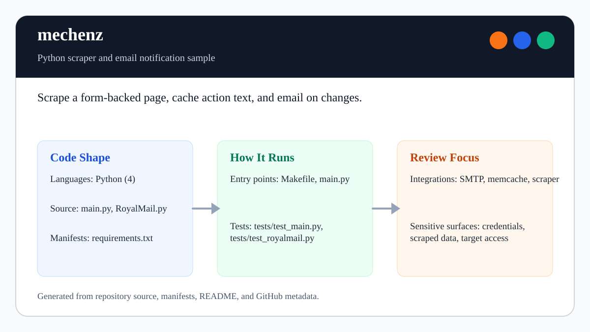

# mechenz

<!-- README-OVERVIEW-IMAGE -->


## Overview

`garethpaul/mechenz` is a Python scraper and email notification sample. It polls a form-backed page, caches the latest scraped action list in memcache, and sends an SMTP notification when the data changes.

This README is based on the checked-in source, manifests, scripts, and repository metadata on the `master` branch. The project language mix found during review was: Python.

## Repository Contents

- `README.md` - project overview and local usage notes
- `CHANGES.md` - recent maintenance changes
- `Makefile` - local verification entry point
- `RoyalMail.py` - SMTP notification helper
- `main.py` - scraper, parser, cache comparison, and notification flow
- `requirements.txt` - live-run dependency compatibility ranges
- `constraints.txt` - reviewed exact dependency graph used by CI
- `settings.py.example` - local settings template without secrets
- `tests` - offline unit tests for parsing, cache comparison, and SMTP setup
- `SECURITY.md` - security reporting and disclosure guidance
- `VISION.md` - project direction and maintenance guardrails

Additional scan context:

- Source files: main.py, RoyalMail.py
- Dependency and build manifests: Makefile, requirements.txt, constraints.txt
- Entry points or build surfaces: `make lint`, `make test`, `make build`, `make check`, main.py
- Test-looking files: tests/test_main.py, tests/test_royal_mail.py, tests/test_royalmail.py

## Getting Started

### Prerequisites

- Git
- Python 3.10 or newer
- Optional for live polling: memcached and the packages in `requirements.txt`

### Setup

```bash
git clone https://github.com/garethpaul/mechenz.git
cd mechenz
make lint
make test
make build
make check
cp settings.py.example settings.py
```

The setup commands above are derived from repository files. Legacy mobile, Python, or JavaScript samples may require older SDKs or package versions than a modern workstation uses by default.

## Running or Using the Project

- Install live-run dependencies when you are ready to poll a real site:

```bash
python3 -m pip install -r requirements.txt -c constraints.txt
```

- Fill in `settings.py` locally, start memcached, export SMTP credentials, and run:

```bash
export SMTP_LOGIN="sender@example.com"
export SMTP_PASSWORD
python3 main.py
```

## Testing and Verification

- `make lint` runs the static baseline and repository guardrails.
- `make test` runs `python3 -m unittest discover -s tests`.
- `make build` compiles the Python modules.
- `make check` cleans generated Python artifacts, then runs lint, test, and build.
- The Make gates are location-independent. From another directory, pass the
  checkout's Makefile by absolute path, such as
  `make -f /path/to/mechenz/Makefile check`.
- The tests do not require mechanize, memcache, SMTP credentials, Gmail, a target site, or a private `settings.py`.
- Action parsing keeps nested container depth balanced so an ordinary inner
  `div` cannot hide the first span that follows it.
- Pinned `ubuntu-24.04` GitHub Actions installs `requirements.txt` through the
  reviewed versions in `constraints.txt`, runs
  `pip check`, and executes `make check` on Python 3.12 through a read-only,
  credential-free checkout. Hosted tests remain offline and do not scrape
  target sites, connect to memcached, authenticate to SMTP, or send email.
- The constraints freeze the reviewed direct and transitive versions, but they
  do not authenticate downloaded artifacts with hashes.

When the required SDK or runtime is unavailable, use static checks and source review first, then verify on a machine that has the matching platform toolchain.

## Configuration and Secrets

- Keep `settings.py`, SMTP credentials, target-site secrets, `.env` files, logs, and scraped private data out of git.
- Use `settings.py.example` only as a placeholder template with fake values.
- Scrape settings validation rejects blank job names, recipients, target sites, fake user agents, and fake referers before a live run.
- Scrape URL validation rejects non-HTTP(S) target and result URLs before a live run.
- A 15-second scrape request timeout bounds the initial page, form submission,
  and optional result-page fetch.
- A 1 MiB scrape response body limit rejects oversized result pages before
  decoding or action parsing.
- Memcache server normalization accepts one endpoint or a nonblank endpoint
  sequence, trims whitespace, and rejects malformed configuration before the
  optional client dependency is imported.
- SMTP numeric setting validation restricts ports to `1..65535` and timeouts to
  finite values no greater than 300 seconds without echoing raw configuration.
- SMTP recipient normalization strips recipient addresses and rejects all-blank recipient lists before opening SMTP connections.
- SMTP header validation rejects CRLF in sender, recipient, or subject values
  before opening SMTP connections.
- Robot setting validation rejects ambiguous `respect_robots` and `MECHENZ_IGNORE_ROBOTS` values without echoing raw configuration values.
- Scrape encoding validation rejects unknown response encodings before a live
  run without echoing raw configuration values.
- Prefer `SMTP_LOGIN` and `SMTP_PASSWORD` environment variables for SMTP credentials; `settings.py` SMTP fields exist only for local compatibility.
- Keep `respect_robots = True` unless target-site access rules are documented.

## Security and Privacy Notes

- Review changes touching authentication or token handling; examples from the scan include RoyalMail.py.
- Review changes that scrape live sites, disable robot handling, store scraped data, or send email.
- Keep scrape settings validation in place so blank target or recipient settings fail before live scraping or email delivery.
- Keep scrape URL validation in place so malformed or non-HTTP(S) targets fail before mechanize opens them.
- Keep robot setting validation in place so typos do not silently disable robot handling.
- Keep scrape encoding validation in place so invalid response codec names fail before live scraping.
- Keep the scrape response body limit ahead of decoding and parser execution.
- Keep nested action parser depth coverage in place when changing response
  selectors or fixture shapes.
- Keep SMTP header validation in place so sender, recipient, and subject values
  cannot inject additional mail headers.
- Tests should use fixtures and injected fakes, not live target sites, memcache, or SMTP.

## Maintenance Notes

- Run `make lint`, `make test`, `make build`, and `make check` before pushing scraper, parser, mailer, dependency, settings-template, or documentation changes.
- Use an absolute Makefile path when running those gates outside the checkout.
- See `docs/plans/2026-06-08-mechenz-baseline.md` for the current baseline plan.
- See `docs/plans/2026-06-09-make-gate-targets.md` for the local gate target guardrail.
- See `docs/plans/2026-06-09-mail-settings-validation.md` for the SMTP numeric setting validation guard.
- See `docs/plans/2026-06-09-scrape-url-validation.md` for the scrape URL validation guard.
- See `docs/plans/2026-06-10-scrape-encoding-validation.md` for the scrape encoding validation guard.
- See `docs/plans/2026-06-13-nested-action-parser.md` for the nested action
  parser depth guard.
- See `SECURITY.md` for vulnerability reporting and safe research guidance.
- See `VISION.md` for project direction and contribution guardrails.

## Contributing

Keep changes small and tied to the project that is already present in this repository. For code changes, document the toolchain used, avoid committing generated dependency directories or local configuration, and update this README when setup or verification steps change.
